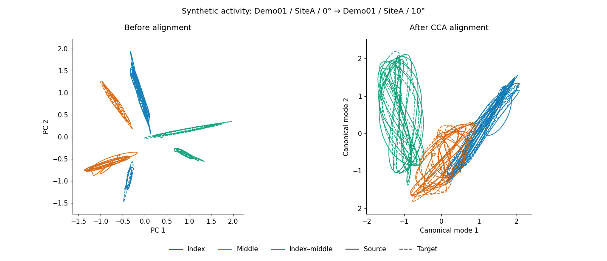
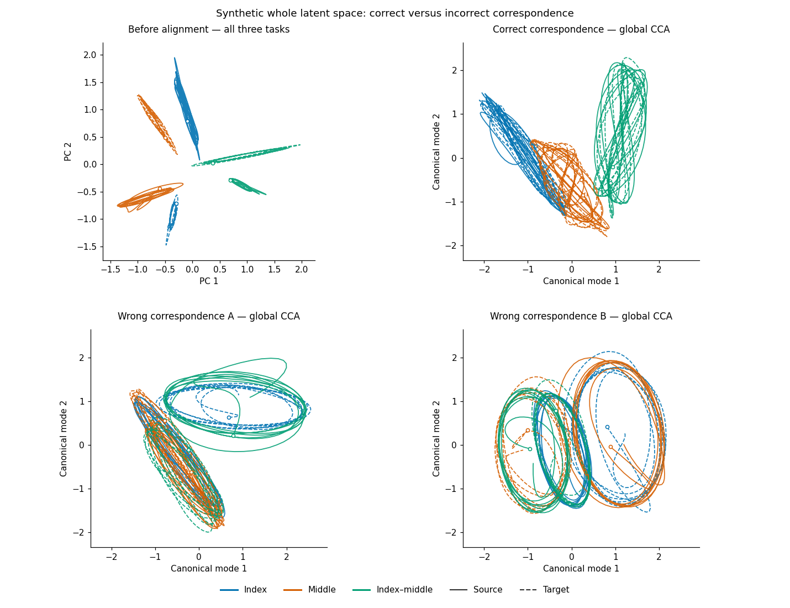

# Motor-unit manifold analysis

Step-by-step Jupyter notebooks for tracked motor-unit population activity: PCA90 dimensionality,
global canonical correlation analysis (CCA), and visual alignment controls.

**Start with the executed synthetic example to see all tables and plots immediately.**
The analysis template is ready for locally supplied edited recordings and MU tracking dictionaries.
All explanations and figure labels are in English.

## Two notebooks, two uses

| Notebook | Purpose | Inputs | Included outputs |
| --- | --- | --- | --- |
| [PCA90_Alignment_Controls.ipynb](PCA90_Alignment_Controls.ipynb) | Analyze your own tracked-MU recordings | MATLAB v7.3 edited recordings and CSV identity dictionaries supplied locally | None: paths are blank and execution outputs are cleared |
| [PCA90_Alignment_Controls_Example.ipynb](PCA90_Alignment_Controls_Example.ipynb) | Follow a completed, rerunnable example | Generated entirely in memory; no input files or path edits | PCA90 table for 20 synthetic conditions, CCA metric tables, and six comparison figures |

The example follows the same seven modules as the analysis template. It contains **synthetic signals
and invented MU identities only**. Its values are computed by the notebook and are not experimental findings.
No participant recordings, private tracking dictionaries, raw MU traces or private data-derived parameters
are included in this repository.

## Quick start

Install dependencies into the Python environment used by your Jupyter kernel:

```sh
python -m pip install -r requirements.txt
python -m jupyterlab PCA90_Alignment_Controls_Example.ipynb
```

Open the example and run all cells. No data download or helper module is required for the self-contained
example. Python 3.13 was used to execute it; `requirements.txt` records the verified environment versions.

For your own recordings, open `PCA90_Alignment_Controls.ipynb`, keep `manifold_workflow.py` beside it,
and follow [INPUTS.md](INPUTS.md). Fill in `DATA_ROOT` and `DICTIONARY_ROOT`, then set the subjects,
angles and source/target comparison. The template's `sub1` and `sub2` labels are configuration placeholders.

For reading without Jupyter, download [the standalone HTML example](PCA90_Alignment_Controls_Example.html)
and open it in a browser. It embeds every figure and table; GitHub displays HTML source rather than hosting
this file as a live page.

## Module guide

| Module | Analysis operation | What to inspect |
| --- | --- | --- |
| 1. Configuration | Select cohort and source/target condition | Blank paths in the template; in-memory generation in the example |
| 2. Tracked-MU matrices and PCA | Preprocess discharge events, assemble unique MU columns, stack tasks, fit PCA | Number of PCs explaining at least 90% variance and dimensions retained for alignment |
| 3. Visual conventions | Define trajectory plots and global CCA | Task colors, solid source lines, dashed target lines |
| 4. Before/after alignment | Fit one global CCA to the pooled source and target spaces | 2D/3D comparisons and every fitted canonical correlation |
| 5. Temporal-block control | Permute blocks within tasks, then refit PCA and CCA | Unshuffled/shuffled figures and canonical correlation table |
| 6. Whole-space task mismatch | Keep pooled PCA fixed; fit one global CCA per correct or incorrect task correspondence | Two cyclic wrong-task controls, true task colors and correspondence/metric tables |
| 7. Completion and optional exports | Display inline; optionally write files to a chosen directory | No default export directory |

## Synthetic figure previews

All previews below are generated from the synthetic example. Each panel contains the complete pooled
three-task latent space; task colors are retained after alignment.

### Before and after global CCA



### Correct and incorrect task correspondences



Additional 2D and 3D temporal-control and alignment images are embedded in the executed notebook.

## Key analysis choices

- Preprocessing uses 400 ms periodic Hann smoothing, a 0.75 Hz high-pass filter, and per-recording per-MU min-max normalization.
- Each task is cropped from its start to that task's minimum native length across the configured cohort. There is no downsampling or phase interpolation before PCA; display stride only reduces plotted points.
- A dictionary assigns tracked appearances to the same MU column before PCA. Identity scope is one subject, location and angle across tasks. Missing task memberships produce zero blocks.
- PCA is mean-centered and retains at least three dimensions for alignment, even if fewer PCs already explain 90% variance.
- CCA uses all retained PCA dimensions. The table reports regularized canonical correlations and their top-three mean; the plots show the first two or three modes.
- The wrong-task control uses one global alignment per correspondence across all three tasks. It does not fit independent task-pair CCA models. Every fit uses the same matched-length sample sets, and full trajectories are projected afterward.

High correlation under an incorrect task pairing does not establish correct task identity alignment.
These are fitted-data descriptions, not held-out validation or statistical significance tests.
The synthetic generator illustrates software behavior; it is not an MU tracking algorithm or a physiological model.

## Input and output handling

The input-based notebook requires edited MATLAB v7.3/HDF5 recordings with sampling rate, pulse-matrix
dimensions and discharge-event sample indices, plus CSV dictionaries containing `unique_mu`, `task`
and `mu_index0`. [INPUTS.md](INPUTS.md) specifies the exact names, structures and index conventions.

Both notebooks ship with `DATA_ROOT = ""`, `DICTIONARY_ROOT = ""`, `OUTPUT_DIR = ""`, and
`SAVE_OUTPUTS = False`. Jupyter can save inline output inside a notebook; separate exports require an
explicit output directory and opt-in. The example deliberately retains only its synthetic outputs.

Before publishing a run on private recordings, clear the analysis notebook's outputs and reset its paths.
The supplied `.gitignore` excludes common data/output folders and MAT/NPZ files; it cannot remove data
or paths already embedded inside a notebook.
